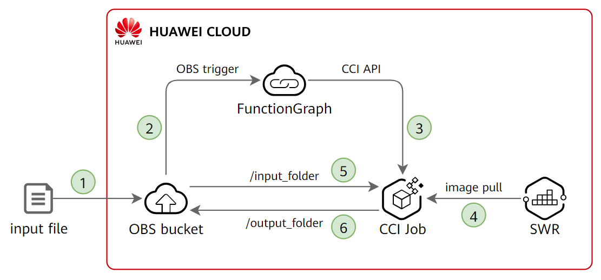
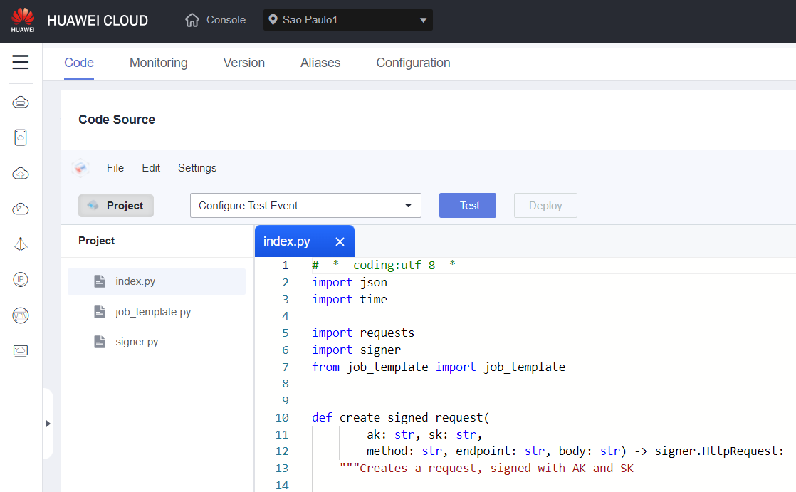
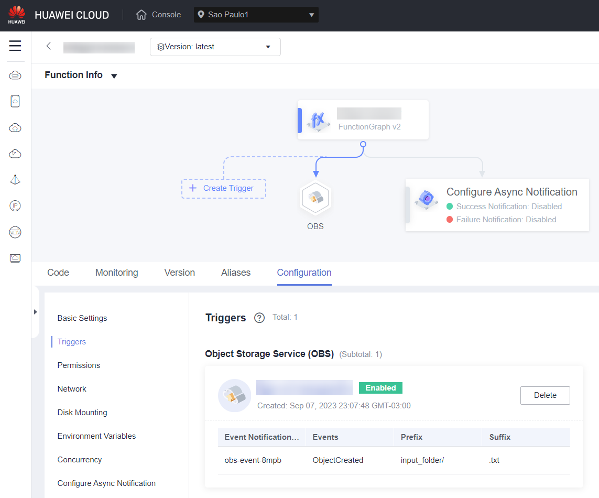
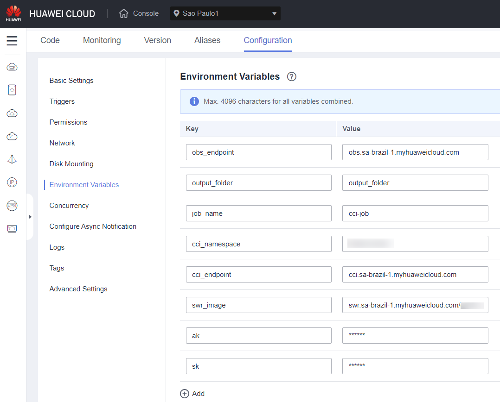
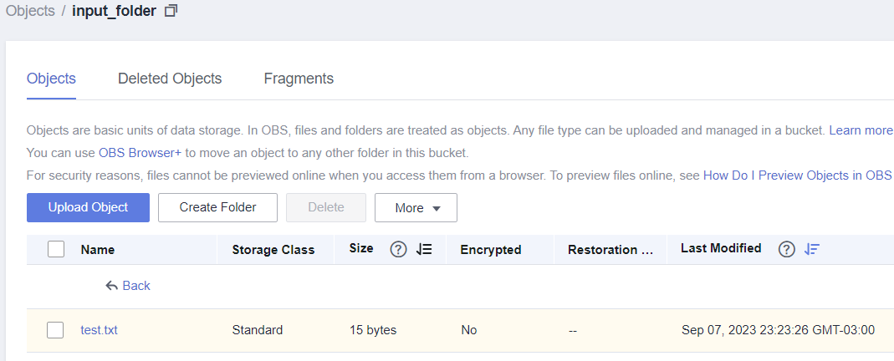
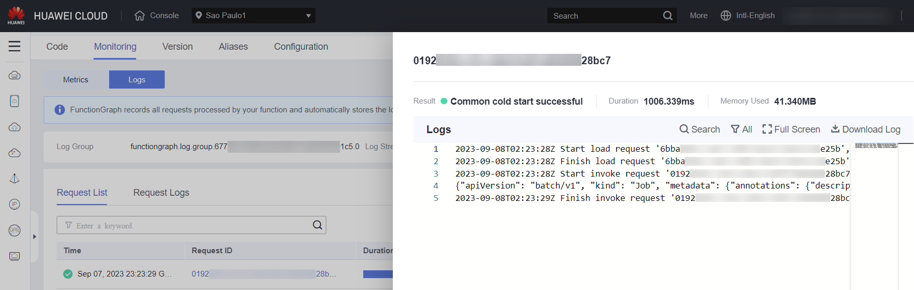
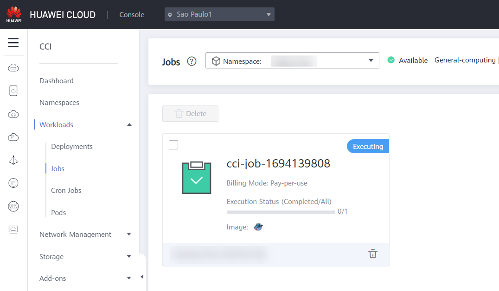
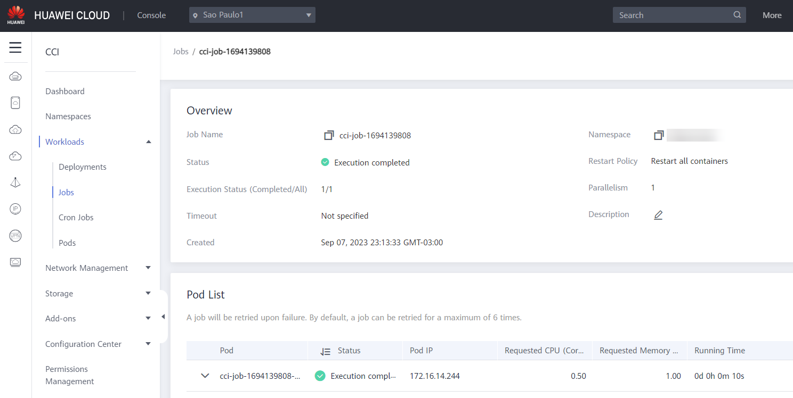
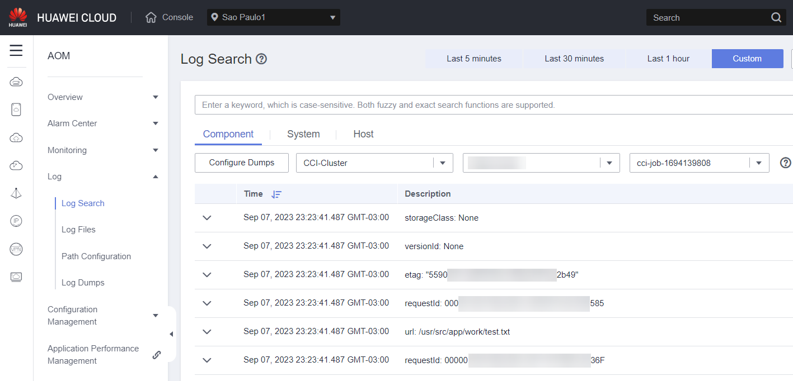
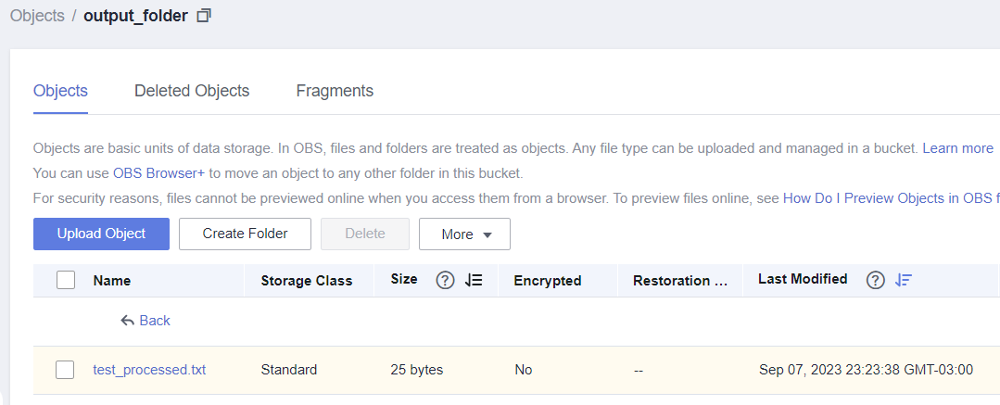

# HUAWEI CLOUD OBS-FGS-CCI

This repository contains a minimal reproducible example for asynchronous
[Object Storage Service (OBS)][obs] file processing with
[FunctionGraph (FGS)][fgs] and [Cloud Container Instance (CCI)][cci] services
from [HUAWEI CLOUD][hwc].

## Architecture and process



1. File is saved to OBS bucket in `input_folder`;
2. The ObjectCreated event triggers the FunctionGraph function;
3. The function uses the CCI API to start a Job, passing the input file path and other data through environment variables, and then stops running;
4. CCI pulls the container image from [SoftWare Repository for Container (SWR)][swr];
5. The CCI Job/container downloads the input file and processes it;
6. The CCI Job/container saves the output file back to OBS and then stops running.

## Preparation

### Identity and Access Management (IAM)

#### Create IAM User and download access key

[Create an IAM User][create-iam] to be used exclusively for this pipeline.
For Access Type, select only "Programatic Access". Do not assign to any user
group.

In the "Download Access Key" message, click "OK" to download `credentials.csv`
file, which contains the AK/SK for this IAM User. This file will have the
following content:

```plain
User Name,Access Key Id,Secret Access Key
username,1FAF***7UUO,IvRd******rm8t
```

On the second line, the second value is the Access Key (AK), and the third
value is the Secret Access Key (SK). We will use them later.

#### Assign permissions to IAM User

[Assign permissions to the IAM User][iam-permission] created. In the IAM User
list, click on "Authorize" in the Operation column.

In "Authorization Method", click on "Select permissions", search for "CCI
CommonOperations" and select it.

### Object Storage Service (OBS)

#### Create the OBS bucket

If you don't need to mount the OBS bucket in an ECS, for example,
[Create an OBS bucket][create-obs] in the desired region. Select an unique
bucket name, use the "Standard" storage class, and use "Private" bucket policy.

If you need to mount the OBS bucket in an ECS and use it as a file system, for
example, [Create a Parallel File System][create-pfs] (a special type of OBS
bucket) in the desired region. Select an unique file system name and use
"Private" policy.

#### Create input folder

In the OBS bucket console, [create a folder][create-obs-folder] named
"input_folder". Files uploaded in this folder will trigger the FunctionGraph
function.

### SoftWare Repository for Containers (SWR)

SWR is used to host container
images on Huawei Cloud. [Create an organization in the desired region][swr-org]
to host the image that will be used in CCI.

## Container image and CCI

With [Docker installed][docker-install] in your machine, open the terminal in
the `cci_image` directory and build the container image, using the SWR path
(with your organization name) as tag:

`docker build -t swr.{region}.myhuaweicloud.com/{SWR organization}/{image name}:{image version}`

Go to the SWR Console and [get a temporary login command][swr-login] by
clicking on "Generate Login Command". Copy the command and execute in your
terminal.

`docker login -u {region}@0M***5Q -p 46***1d swr.{region}.myhuaweicloud.com`

Then, push your image to SWR:

`docker push swr.{region}.myhuaweicloud.com/{SWR organization}/{image name}:{image version}`

Finally, [create a Namespace in CCI][cci-namespace]. This namespace will be
used to create the Job using FunctionGraph.

## FunctionGraph

Make a zip file containing the three files in the `functiongraph` folder (do
not compress the whole folder).

[Create a Event Function from scratch][create-fgs], selecting"Python 3.10" as
Runtime.

In the Code view, click on "Upload" on the top right corner, select "Local ZIP"
and upload the zip file with the code.



[Create an OBS Trigger][fgs-obs] for the function, with the following
configuration:

- Trigger Type: Object Storage Service (OBS)
- Bucket Name: name of OBS bucket
- Events: ObjectCreated
- Event Notification Name: choose an unique name or use the default one
- Prefix: `input_folder/` (created previously)
- Suffix: `.txt` (only .txt files will be processed in our example)



[Configure the following environment variables][fgs-env]:

- `ak`: Access Key (AK) from `credentials.csv`
- `sk`: Secret Access Key (SK) from `credentials.csv`
- `obs_endpoint`: OBS endpoint (example: `obs.sa-brazil-1.myhuaweicloud.com`)
- `output_folder`: where output file will be written (example: `output_folder`)
- `job_name`: base name CCI job (example: `cci-job`), which will have the
    current timestamp appended to make the final CCI job name
- `cci_namespace`: which namespace will be used to create the CCI job
- `cci_endpoint`: CCI endpoint (example: `cci.sa-brazil-1.myhuaweicloud.com`)
- `swr_image`: path to SWR image (example:
    `swr.sa-brazil-1.myhuaweicloud.com/myorg/myimage:0.1.0`)



## Test

Create a simple text file, save with `.txt` extension, and upload to the
`input_folder` in the OBS bucket.



In the FunctionGraph Console, Monitoring tab, Logs view, click in the Request ID to see the execution logs.



In the CCI Console, in the Workloads > Jobs
page, check that the Job was created and executed successfully.



Click on the Job name. After some seconds, check that the Execution completed successfully.



In the Pod list, click in the "View Logs" operation to check the container output, saved by [Application Operations Management (AOM)][aom] service.



Check the output folder of OBS and see that the output file was saved successfully.



## References

- Using an OBS Trigger in FunctionGraph: <https://support.huaweicloud.com/intl/en-us/usermanual-functiongraph/functiongraph_01_0205.html>
- API Request Signing with Python: <https://support.huaweicloud.com/intl/en-us/devg-apisign/api-sign-sdk-python.html>
- Creating a Job with CCI API: <https://support.huaweicloud.com/intl/en-us/api-cci/createBatchV1NamespacedJob.html>
- OBS Python SDK Overview: <https://support.huaweicloud.com/intl/en-us/sdk-python-devg-obs/obs_22_0100.html>
- Quickly using the OBS Python SDK: <https://support.huaweicloud.com/intl/en-us/sdk-python-devg-obs/obs_22_0500.html>

[hwc]: <https://www.huaweicloud.com/intl/en-us/>
[obs]: <https://support.huaweicloud.com/intl/en-us/obs/index.html>
[fgs]: <https://support.huaweicloud.com/intl/en-us/functiongraph/index.html>
[cci]: <https://support.huaweicloud.com/intl/en-us/cci/index.html>
[create-iam]: <https://support.huaweicloud.com/intl/en-us/qs-iam/iam_01_0031.html>
[iam-permission]: <https://support.huaweicloud.com/intl/en-us/usermanual-iam/iam_01_0652.html>
[create-obs]: <https://support.huaweicloud.com/intl/en-us/ugobs-obs/obs_41_0009.html>
[create-pfs]: <https://support.huaweicloud.com/intl/en-us/pfsfg-obs/obs_13_0002.html>
[create-obs-folder]: <https://support.huaweicloud.com/intl/en-us/usermanual-obs/obs_03_0316.html>
[swr]: <https://support.huaweicloud.com/intl/en-us/swr/index.html>
[swr-org]: <https://support.huaweicloud.com/intl/en-us/usermanual-swr/swr_01_0014.html>
[swr-login]: <https://support.huaweicloud.com/intl/en-us/usermanual-swr/swr_01_0011.html>
[docker-install]: <https://docs.docker.com/engine/install/>
[cci-namespace]: <https://support.huaweicloud.com/intl/en-us/qs-cci/cci_qs_0004.html>
[create-fgs]: <https://support.huaweicloud.com/intl/en-us/qs-functiongraph/functiongraph_04_0101.html>
[fgs-obs]: <https://support.huaweicloud.com/intl/en-us/usermanual-functiongraph/functiongraph_01_0205.html>
[fgs-env]: <https://support.huaweicloud.com/intl/en-us/usermanual-functiongraph/functiongraph_01_0154.html>
[aom]: <https://support.huaweicloud.com/intl/en-us/aom/index.html>
